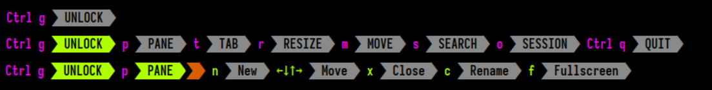

# Keybinding Presets
Keybinding Presets are a set of keybindings that can be used to control Zellij. Zellij comes with two such presets out of the box, intended to fit different kinds of users. They are described below.

### The `default` preset

This preset should fit most users of Zellij. In it, all modes are accessible from the basic "normal" mode in which the user spends most of their time. One can enter `Pane` mode by pressing `Ctrl p` and then have access to all commands inside pane mode (eg. `n` to open a new pane or `x` to close the focused pane).

### The `Unlock-First (non-colliding)` preset

This preset is tailored to users who use terminal applications with keyboard shortcuts that collide with Zellij's own keybindings. In this preset, users "unlock" the interface before accessing the various input modes. The modes themselves can then be accessed with a single character shortcut.

So for example, in order to open a new pane, the user would press: `Ctrl g` followed by `p` followed by `n`. The Zellij maintainers found that after a short adjustment period, this is a fast, efficient and most importantly mentally-consistent way of interacting with the application.

## How to switch between presets?

Switching between these presets is possible with the `Configuration` screen. Accessible with:

* `Ctrl o` + `c` in the default preset
* `Ctrl g` + `o` + `c` in the `Unlock-First` preset

The configuration screen overrides the current keybindings with those of the selected preset. Either temporarily just for the relevant session, or permanently by writing them to the configuration file.

Choosing between the two is also an option given to users on the first-run of Zellij if they do not already have a configuration file in place.
