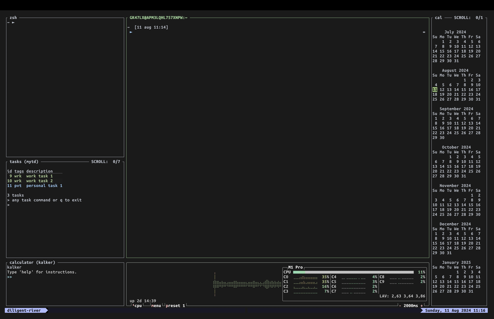

# Example layouts

## Classic three pane with vertical root

```javascript
layout {
    pane split_direction="vertical" {
        pane
        pane split_direction="horizontal" {
            pane
            pane
        }
    }
}
```

Will provide:


## Classic three panes with vertical root and compact status bar

```javascript
layout {
    pane split_direction="vertical" {
        pane
        pane split_direction="horizontal" {
            pane
            pane
        }
    }
    pane size=1 borderless=true {
        plugin location="zellij:compact-bar"
    }
}
```

Will provide:


## Quick generic project explorer

Cloned a new project, want to quickly explore it without much fuss?

```javascript
layout {
    pane split_direction="vertical" {
        pane
        pane split_direction="horizontal" {
            pane command="exa" {
                args "--color" "always" "-l"
            }
            pane command="git" {
                args "log"
            }
        }
    }
}
```

Will provide:


## Basic Rust project

Basic layout for a rust executable project

```javascript
layout {
    pane split_direction="vertical" size="60%" {
        pane edit="src/main.rs"
        pane edit="Cargo.toml"
    }
    pane split_direction="vertical" size="40%" {
        pane command="cargo" {
            args "run"
            focus true
        }
        pane command="cargo" {
            args "test"
        }
    }
}
```

When started in a project just created with `cargo init`, looks like this:


For convenience, here's a version that also loads Zellij's interface

```javascript
layout {
    pane size=1 borderless=true {
        plugin location="zellij:tab-bar"
    }
    pane split_direction="vertical" size="60%" {
        pane edit="src/main.rs"
        pane edit="Cargo.toml"
    }
    pane split_direction="vertical" size="40%" {
        pane command="cargo" {
            args "run"
            focus true
        }
        pane command="cargo" {
            args "test"
        }
    }
    pane size=2 borderless=true {
        plugin location="zellij:status-bar"
    }
}
```

## A more complex example (Zellij development)
Here's a layout used internally for Zellij development.

It can help on-board new developers by tying together related files and their tests, as well as useful plugins here and there.

```javascript
layout {
    default_tab_template {
        pane size=1 borderless=true {
            plugin location="zellij:tab-bar"
        }
        children
        pane size=2 borderless=true {
            plugin location="zellij:status-bar"
        }
    }
    pane_template name="tests_under_files" {
        pane split_direction="horizontal" {
            children
            pane command="cargo" size="30%" {
                args "test"
            }
        }
    }
    tab_template name="strider_tab" {
        pane size=1 borderless=true {
            plugin location="zellij:tab-bar"
        }
        pane split_direction="Vertical" {
            pane size="15%" {
                // TODO: when we support sending CWD to plugins, this should start in ./zellij-derver
                plugin location="zellij:strider"
            }
            children
        }
        pane size=2 borderless=true {
            plugin location="zellij:status-bar"
        }
    }
    strider_tab name="Server (root)" cwd="./zellij-server" focus=true {
        tests_under_files split_direction="vertical" {
            pane edit="./src/lib.rs"
            pane edit="./src/route.rs"
        }
    }
    tab name="Client (root)" cwd="./zellij-client" {
        tests_under_files split_direction="vertical" {
            pane edit="./src/lib.rs"
            pane edit="./src/input_handler.rs"
        }
    }
    tab name="Server (screen thread)" split_direction="vertical" cwd="./zellij-server/src" {
        pane edit="./screen.rs" name="SCREEN"
        pane edit="./tab/mod.rs" name="TAB"
        pane edit="./panes/terminal_pane.rs" name="TERMINAL PANE"
    }
    tab name="Server (pty thread)" split_direction="vertical" cwd="./zellij-server/src" {
        pane edit="./pty.rs" name="PTY"
        pane edit="./os_input_output.rs" name="OS_INPUT_OUTPUT"
    }
    tab name="Server (pane grids)" split_direction="horizontal" cwd="./zellij-server/src/panes" {
        pane split_direction="vertical" {
            pane edit="./tiled_panes/mod.rs" name="TILED PANES"
            pane edit="./tiled_panes/tiled_pane_grid.rs" name="TILED PANES - GRID"
            pane edit="./tiled_panes/pane_resizer.rs" name="TILED PANES - GRID - RESIZER"
        }
        pane split_direction="vertical" {
            pane edit="./floating_panes/mod.rs" name="FLOATING_PANES"
            pane edit="./floating_panes/floating_pane_grid.rs" name="FLOATING_PANES - GRID"
        }
    }
    tab name="Server (Terminal)" split_direction="horizontal" cwd="./zellij-server/src/panes" {
        pane split_direction="vertical" {
            pane edit="./terminal_pane.rs" name="TERMINAL PANE"
            pane edit="./grid.rs" name="GRID (ANSI PARSER)"
        }
        pane split_direction="vertical" {
            pane edit="./terminal_character.rs" name="TERMINAL CHARACTER"
            pane edit="./sixel.rs" name="SIXEL"
        }
    }
}
```

Here's how it looks like when opened:


## An example with useful panes

```javascript
layout {
    default_tab_template {
        children
        pane size=1 borderless=true {
            plugin location="file:~/.config/zellij/plugins/zjstatus.wasm"{
                format_left  "{mode}#[fg=white,bg=#b1bbfa,bold]{session}  #[fg=#b1bbfa,bg=#000000]"
                format_center "{tabs}"
                format_right "#[fg=#181825,bg=#b1bbfa]{datetime}"
                format_space "#[bg=#181825]"

                hide_frame_for_single_pane "true"

                mode_normal  "#[bg=#b1bbfa] "

                tab_normal   "#[fg=#C0C0C0]"
                tab_active   "#[fg=#00FF00,bold] "

                datetime          "#[fg=#6C7086,bg=#b1bbfa,bold] {format} "
                datetime_format   "%A, %d %b %Y %H:%M"
                datetime_timezone "Europe/Amsterdam"
            }
        }
    }
    tab focus=true split_direction="Vertical" {
        pane split_direction="Vertical" {
            pane split_direction="Horizontal" size="25%"{
                pane split_direction="Horizontal"{
                  pane size="50%" name="zsh" command="~/.bin/barefoot-zsh"  // ~/.config/barefoot-zsh
                  pane name="tasks (mytd)" command="mytd"
                }
                pane size="16%" name="calculator (kalker)" command="kalker"
            }
            pane split_direction="Horizontal"{
                pane size="84%" focus=true
                pane size="16%" name="cpu" command="btop" borderless=true{
                    args "-p" "1"
                }
            }
            pane size="12%" name="cal" command="mycal"
        }
    }
}
```

Here's a screenshot



## Your layout here?

Please make PRs with cool layouts (and screenshots!) to [our website repo](https://github.com/zellij-org/zellij-org.github.io) and we'd be happy to include your name and a link to your profile.
