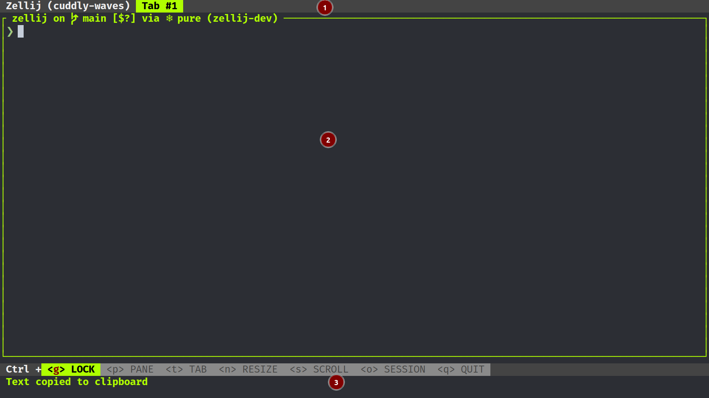
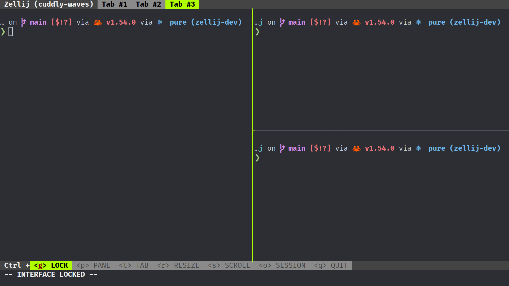

## Layout Templates

The templates section of the layout file describes the structure of the layout.
To understand how it works let us look at the default layout a little bit closer.

* ` zellij setup --dump-layout default`:
```
---
template:
  direction: Horizontal
  parts:
    - direction: Vertical  # part 1
      borderless: true
      split_size:
        Fixed: 1
      run:
        plugin:
          location: "zellij:tab-bar"
    - direction: Vertical # part 2
      body: true
    - direction: Vertical # part 3
      borderless: true
      split_size:
        Fixed: 2
      run:
        plugin:
          location: "zellij:status-bar"
```
The default layout consists of three parts.
The plugin tab-bar (part 1), a body (part 2) and the status-bar plugin (part 3).

Since the `tabs` section is empty, a default pane will be inserted in to the
body section



Let us now use the default layout and build upon it:
```
---
template:
  direction: Horizontal
  parts:
    - direction: Vertical  # part 1
      borderless: true
      split_size:
        Fixed: 1
      run:
        plugin:
          location: "zellij:tab-bar"
    - direction: Vertical # part 2
      body: true
    - direction: Vertical # part 3
      borderless: true
      split_size:
        Fixed: 2
      run:
        plugin:
          location: "zellij:status-bar"
tabs:
  - name: "tab 1" # tab 1
  - name: "tab 2" # tab 2
    direction: Vertical
    parts:
      - direction: Horizontal
      - direction: Horizontal
  - name: "tab 3" # tab 3
    direction: Vertical
    parts:
      - direction: Horizontal
      - direction: Horizontal
        parts:
          - direction: Horizontal
          - direction: Vertical
```
This layout will create the following tabs upon loading.

Tab 1:

Tab 2:

Tab 3:


This is how the tabs would look like with pane frames disabled.

Tab 1:

Tab 2:

Tab 3:

