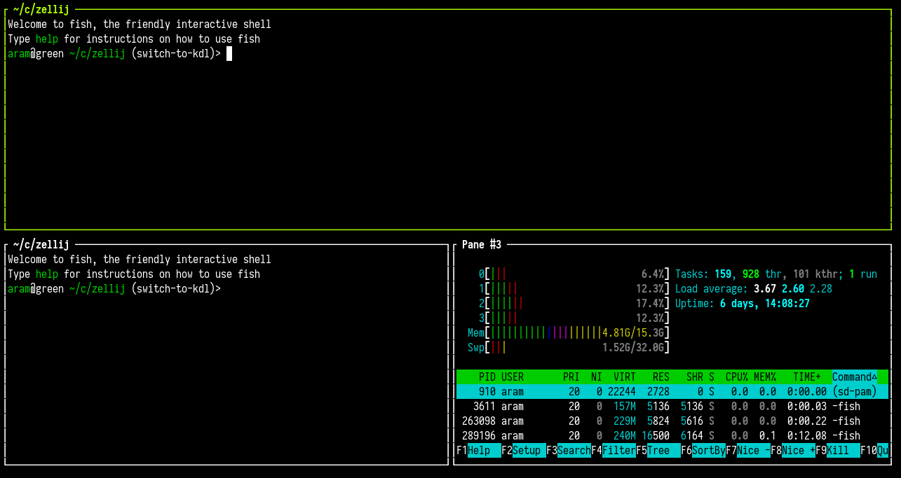

# Layouts

Layouts are text files that define an arrangement of Zellij panes and tabs.

You can read more about [creating a layout](./creating-a-layout.md)

### Example

A basic layout can look like this:
```javascript
// layout_file.kdl

layout {
    pane
    pane split_direction="vertical" {
        pane
        pane command="htop"
    }
}
```
Which would create the following layout:




### Applying a Layout

A layout can be applied when Zellij starts:
```
$ zellij --layout /path/to/layout_file.kdl
```

Or by setting it up in the [configuration](./configuration.md).

A layout can also be applied inside a running session with the same command:
```
$ zellij --layout /path/to/layout_file.kdl
```
In this case, Zellij will start this layout as one or more new tabs in the current session.

A layout can also be applied from a remote URL:
```
$ zellij --layout https://example.com/layout_file.kdl
```
For security reasons, remote layouts will have all their commands suspended behind a `Waiting ro run <command>` banner - prompting the user to run each one.

### Layout default directory

By default Zellij will load the `default.kdl` layout, found in the `layouts` directory (a subdirectory of the `config` directory).
This will be probably under `~/.config/zellij/layouts` on a Linux system.

If not found, Zellij will start with one pane and one tab.

Layouts residing in the default directory can be accessed by their bare name:
```
zellij --layout [layout_name]
```

### Runtime Layout Override

The layout of a running tab can be overridden without restarting the session. This is done via the `override-layout` CLI action or the `OverrideLayout` keybinding action:

```
$ zellij action override-layout /path/to/new-layout.kdl
```

Options allow retaining existing panes that do not fit the new layout:
```
$ zellij action override-layout /path/to/layout.kdl --retain-existing-terminal-panes --apply-only-to-active-tab
```

This enables dynamic workspace reorganization. For the full reference, see [override-layout in CLI actions](./cli-actions.md#override-layout) and [OverrideLayout in keybinding actions](./keybindings-possible-actions.md#overridelayout).

### Layout Configuration Language

Zellij uses [KDL](https://kdl.dev) as its configuration language.
