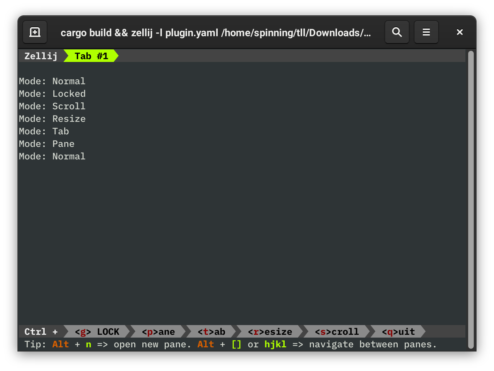

# Writing a Plugin in Rust

Writing a Zellij plugin in Rust is incredibly easy thanks to Rust's first-class support for WebAssembly and the simple [`zellij-tile`][zellij-tile] scaffolding library. This guide will walk through implementing the [`rust-plugin-example`][example], a simple event logger that records mode-changes within Zellij.

[zellij-tile]: https://docs.rs/zellij-tile/
[example]: https://github.com/zellij-org/rust-plugin-example

## Getting Started
### Installing Rust & Zellij

First things first, to develop a plugin in Rust, you'll need Rust installed! The easiest way to do this is by using [rustup][rustup].

Once you have Rust and Cargo installed, getting the latest version of Zellij is as easy as running:
```
cargo install zellij
```

You'll also want to add the installed binary to your path!

[rustup]: https://rustup.rs/

### Cloning The Template Repository

To streamline the development experience, we provide a [template repository][template] that contains everything you need to get started quickly!

You can use a tool called [`cargo-generate`][generate] to fill in a couple of the gaps automatically:
```sh
# First install `cargo-generate`
cargo install cargo-generate
# Then clone the rust-plugin template
cargo generate --git https://github.com/zellij-org/rust-plugin-template.git --name mode-logger
cd mode-logger
```

[template]: https://github.com/zellij-org/rust-plugin-template
[generate]: https://github.com/cargo-generate/cargo-generate

## The Basic Structure of a Rust Plugin

After cloning the template repository, you should have a directory that looks a little bit like this: 
```
.
├── .cargo
│   └── config.toml
├── Cargo.toml
├── plugin.yaml
├── README.md
└── src
    └── main.rs
```

### `.cargo/config.toml`

```toml
[build]
target = "wasm32-wasi"
```

This file specifies a default target for our project. In this case, the correct WASI target is `wasm32-wasi`.

### `Cargo.toml`

```toml
[package]
name = "mode-logger"
version = "0.1.0"
authors = ["Brooks J Rady <b.j.rady@gmail.com>"]
edition = "2018"

[dependencies]
zellij-tile = "1.0.0"
```

This is a quite standard package file that `cargo-generate` has partially filled in for us. Note the dependency on `zellij-tile` which provides some helpful functionality for avoiding boilerplate and writing `unsafe` code.

### `plugin.yaml`

```yaml
---
direction: Horizontal
parts:
  - direction: Vertical
    split_size:
      Fixed: 1
    plugin: tab-bar
  - direction: Vertical
    plugin: target/wasm32-wasi/debug/mode-logger.wasm
  - direction: Vertical
    split_size:
      Fixed: 2
    plugin: status-bar
```

This is a Zellij [Layout](./layouts.md) that loads a mostly default instance of Zellij, but with the middle terminal pane replaced by the plugin being developed. The `plugin: target/wasm32-wasi/debug/mode-logger.wasm` line should point Zellij to the development version of our plugin.

There will likely be a better way of loading plugins in the future, but custom Layouts are currently the only way to do so.

### `src/main.rs`

```rs
use zellij_tile::prelude::*;

#[derive(Default)]
struct State;

register_plugin!(State);

impl ZellijPlugin for State {
    fn load(&mut self) {}

    fn update(&mut self, event: Event) {}

    fn render(&mut self, rows: usize, cols: usize) {}
}
```

When using the `zellij-tile` library, plugins are written as Structs that implement the `ZellijPlugin` trait. The magic line here is `register_plugin!(State)`, which wraps up the `State` struct in a way that neatly exposes its `ZellijPlugin` implementation for Zellij to find.

Note that `load()`, `update()`, and `render()` have default implementations, so you only need to define the callbacks used by your plugin.

## Hello, Zellij!

Let's tweak our `main.rs` a little to say hello!

```rs
use zellij_tile::prelude::*;

#[derive(Default)]
struct State;

register_plugin!(State);

impl ZellijPlugin for State {
    fn load(&mut self) {}

    fn update(&mut self, event: Event) {}

    fn render(&mut self, rows: usize, cols: usize) {
        println!("Hello, Zellij!");
    }
}
```

It really is as simple as that! Anything printed to stdout by the `render()` method will be automatically drawn to the screen in the pane where the plugin is active.

Let's build our plugin and test things out:
```sh
cargo build
zellij --layout-path plugin.yaml
```


## Implementing the Event Logger

That was pretty easy, so let's try to do something a bit more interesting! Let's subscribe to some `Event`s by adding the following code to `load()`:

```rs
fn load(&mut self) {
    subscribe(&[EventType::ModeUpdate]);
}
```

Code in `load()` is called once the first time your plugin is loaded. Aside from that, it's nothing special. Anything that you can do in the `load()` method should be possible from within the `update()` and `render()` methods as well.

The `subscribe()` function is part of `zellij-tile::prelude` and sends a message to Zellij asking to be notified when certain `Event`s occur. In this case, we're subscribing to `ModeUpdate` events. The [documentation for `Event`][event] tells us that a `ModeUpdate` contains the `ModeInfo` struct, which stores the current mode as well as some additional information.

[event]: https://docs.rs/zellij-tile/1.0.0/zellij_tile/data/enum.Event.html

To actually handle these events, we'll need to add some code to our `update()` method:

```rs
fn update(&mut self, event: Event) {
    if let Event::ModeUpdate(mode_info) = event {
        dbg!(mode_info.mode);
    }
}
```

Here we are checking for `ModeUpdate`s and destructuring them to get the current mode. Currently, the `dbg!()` macro is being used to dump this information to stderr. If we want to actually see this debug info, we'll need to run our plugin slightly differently:

```sh
cargo build
# The 2> redirects stderr to dbg.log
zellij -l plugin.yaml 2> dbg.log
```

Do some faffing about in Zellij, changing modes a couple of times, then take a look at `dbg.log`:

```
[src/main.rs:15] mode_info.mode = Normal
[src/main.rs:15] mode_info.mode = Pane
[src/main.rs:15] mode_info.mode = Tab
[src/main.rs:15] mode_info.mode = Resize
[src/main.rs:15] mode_info.mode = Scroll
[src/main.rs:15] mode_info.mode = Locked
[src/main.rs:15] mode_info.mode = Normal
```

Excellent! It looks like our plugin is receiving mode updates! If you'd like to see these sorts of logs live, try opening a second terminal and running `tail -f dbg.log`.

The next thing to do is properly store a log of events and print them to the screen. Let's start by tweaking our `State` struct:

```rs
use std::collections::VecDeque;

#[derive(Default)]
struct State {
    log: VecDeque<String>,
}
```

We've gone with a `VecDeque` so that we can efficiently push `String`s to the *front* of `log` and so we can show off how easy it is to use standard library components from within a plugin.

Let's change the `update()` method again to grow our log:

```rs
fn update(&mut self, event: Event) {
    if let Event::ModeUpdate(mode_info) = event {
        let mode = format!("{:?}", mode_info.mode);
        self.log.push_front(mode);
    }
}
```

Recall that the `{:?}` format specifier simply debug-prints a value and that `log.push_front(mode)` adds a mode `String` to the front of our log messages.

Finally, let's update `render()` to print out all of our log messages:

```rs
fn render(&mut self, rows: usize, cols: usize) {
    for mode in &self.log {
        println!("Mode: {}", mode);
    }
}
```

Let's give things a run with `cargo build && zellij -l plugin.yaml` and test it out!



Excellent! You should notice that, as you cycle through different modes in Zellij, that those updates are being logged on-screen.

This is a good start, but no logger is complete without storing timestamps! Let's import the `chrono` crate for working with time. First we'll need to add it to our `Cargo.toml`:

```toml
[package]
name = "mode-logger"
version = "0.1.0"
authors = ["Brooks J Rady <b.j.rady@gmail.com>"]
edition = "2018"

[dependencies]
zellij-tile = "1.0.0"
chrono = "0.4"
```

Quite a few Rust libraries can compile to WebAssembly without any issue – this is one of them! Let's import it and update `State` to store timestamps:

```rs
use chrono::{DateTime,Local};

#[derive(Default)]
struct State {
    log: VecDeque<(String, DateTime<Local>)>,
}
```

Next we'll need to actually store these timestamps in `update()`:

```rs
fn update(&mut self, event: Event) {
    if let Event::ModeUpdate(mode_info) = event {
        let mode = format!("{:?}", mode_info.mode);
        // Local::now() gets the current time and date
        self.log.push_front((mode, Local::now()));
    }
}
```

Finally, we can `render()` the timestamps to the screen:

```rs
fn render(&mut self, rows: usize, cols: usize) {
    for (mode, time) in &self.log {
        println!("Mode: {} ({})", mode, time.format("%T"));
    }
}
```

The different options for `time.format()` can be found in the [`chrono::format::strftime`][ftime] module; `%T` shows the time in `HH:MM:SS` format.

[ftime]: https://docs.rs/chrono/0.4.19/chrono/format/strftime/index.html

Finally, let's test this out!


It looks like getting the time is working perfectly! Unfortunately, because our different mode names are different lengths, it looks a bit messy at the moment. Luckily, every time that `render()` is called, it passes the size of plugin pane. Let's use the `cols` value to right-align the timestamp:

```rs
fn render(&mut self, _rows: usize, cols: usize) {
    for (mode, time) in &self.log {
        let mode = format!("Mode: {}", mode);
        let time = time.format("%T").to_string();
        let padding = " ".repeat(cols - mode.len() - time.len());
        println!("{}{}{}", mode, padding, time);
    }
}
```

By separately storing the left-aligned mode `String` and the right-aligned timestamp, we can calculate (using `cols`) exactly how much padding we need to fill the screen. Once we've done that, it's just a matter of printing the left half, the padding, then the right half.

If we run this code, we now get the much nicer:


Try resizing your terminal window or the plugin pane and watch how things stay properly justified!

As a final step, let's add a couple of commands that allow the user to clear their history or save their log to a file. To do this, we'll need our plugin to receive `KeyPress` events:

```rs
fn load(&mut self) {
    subscribe(&[EventType::ModeUpdate, EventType::KeyPress]);
}
```

Now we can expand `update()` to handle `ModeUpdate` and `KeyPress` events. Let's make `Ctrl-L` the command for clearing the logs:

```rs
fn update(&mut self, event: Event) {
    match event {
        Event::ModeUpdate(mode_info) => {
            let mode = format!("{:?}", mode_info.mode);
            self.log.push_front((mode, Local::now()));
        }
        Event::KeyPress(Key::Ctrl('l')) => self.log.clear(),
        _ => (),
    }
}
```

When matching against `KeyPress` events, you might find it helpful to explore the [zellij_tile::Key][key] enum.

Also note that we need the catch-all case `_ => ()` because, even though we've only subscribed to the `ModeUpdate` and `KeyPress` events, the Rust compiler on its own can't guarantee that only those events will be passed to `update()`.

[key]: https://docs.rs/zellij-tile/1.0.0/zellij_tile/data/enum.Key.html

Let's try running this, changing modes a couple of times, then pressing `Ctrl-L`:


Incredibly blank! Nicely done!

As one final feature, we'll dump a log of the captured events to `mode-log.txt` when `Ctrl-W` is pressed:

```rs
use std::{fs::File, io::Write};

// ... snip ...

fn update(&mut self, event: Event) {
    match event {
        Event::ModeUpdate(mode_info) => {
            let mode = format!("{:?}", mode_info.mode);
            self.log.push_front((mode, Local::now()));
        }
        Event::KeyPress(Key::Ctrl('l')) => self.log.clear(),
        Event::KeyPress(Key::Ctrl('w')) => {
            if let Ok(mut f) = File::create("mode-log.txt") {
                for (mode, time) in self.log.iter().rev() {
                    writeln!(f, "{}: Entered {} Mode", time.format("%c"), mode).unwrap();
                }
            }
        }
        _ => (),
    }
}
```

A couple of new things here, but all of them are vanilla Rust – nothing changes when writing a plugin! `File::create("mode-log.txt")` is just normal code for creating a file named `mode-log.txt` in the current directory. After the file is created, we're again looping through all of the log events and writing them out (but this time to a file!). The format of the log file is also a bit different from the log we show on-screen. First of all, we're writing things to the log file in *chronological* order (that's why we're reversing our log with `self.log.iter().rev()`), and we've also changed to a more verbose timestamp. The `%c` should look something like this: `Tue Apr 20 10:21:02 2021`.

Let's run Zellij again, change some modes, then press `Ctrl-W`:


We can then look at `mode-log.txt`, which should look something like this:

```
Tue Apr 20 10:20:40 2021: Entered Normal Mode
Tue Apr 20 10:20:46 2021: Entered Pane Mode
Tue Apr 20 10:20:50 2021: Entered Tab Mode
Tue Apr 20 10:20:53 2021: Entered Resize Mode
Tue Apr 20 10:20:57 2021: Entered Scroll Mode
Tue Apr 20 10:21:00 2021: Entered Locked Mode
Tue Apr 20 10:21:02 2021: Entered Normal Mode
```

And that's all, folks! The full code for this example can be found in the [`rust-plugin-example`][code] repository.

[code]: https://github.com/zellij-org/rust-plugin-example/blob/main/src/main.rs

## Further Steps

There are a *lot* of ways that this plugin could be improved! Here are a couple of the things that you might want to try implementing if you're looking for the extra practice:

- **Support for scrolling ::** you'll need to use `rows` and save a cursor position in `State`
- **Make it pretty ::** our default plugins use the [`colored`][colored] crate for fancy formatting
- **Make it more stable ::** if you make the logger pane too small, the plugin will crash!
- **Add a help bar ::** there is currently no UI telling the user about the clear and save features

Have fun, and don't hesitate to get in touch if you find any bugs or would like some guidance :)

[colored]: https://crates.io/crates/colored
