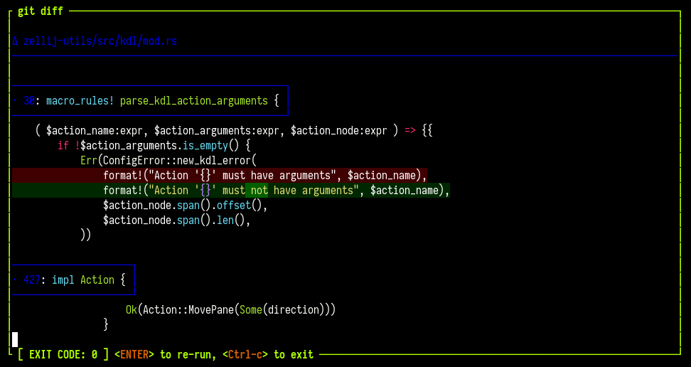

# Zellij Run & Edit

---

- [Zellij Run](#zellij-run) — Launch a command in a new pane with options for floating, blocking, and more
- [Zellij Edit](#zellij-edit) — Open a file in your default editor in a new pane

---

## Zellij Run

Zellij includes a top-level `run` command that can be used to launch a new Zellij pane running a specific command:

eg.
```
$ zellij run -- git diff
```

**OPTIONS**:
```
-b, --borderless <BORDERLESS>     start this pane without a border (warning: will make it
                                  impossible to move with the mouse) [possible values: true,
                                  false]
    --block-until-exit            Block until the command exits (regardless of exit status) OR
                                  its pane has been closed
    --block-until-exit-failure    Block until the command exits with failure (non-zero exit
                                  status) OR its pane has been closed
    --block-until-exit-success    Block until the command exits successfully (exit status 0) OR
                                  its pane has been closed
    --blocking                    Block until the command has finished and its pane has been
                                  closed
-c, --close-on-exit               Close the pane immediately when its command exits
    --close-replaced-pane         Close the replaced pane instead of suspending it (only
                                  effective with --in-place)
    --cwd <CWD>                   Change the working directory of the new pane
-d, --direction <DIRECTION>       Direction to open the new pane in
-f, --floating                    Open the new pane in floating mode
-h, --help                        Print help information
    --height <HEIGHT>             The height if the pane is floating as a bare integer (eg. 1)
                                  or percent (eg. 10%)
-i, --in-place                    Open the new pane in place of the current pane, temporarily
                                  suspending it
-n, --name <NAME>                 Name of the new pane
    --near-current-pane           if set, will open the pane near the current one rather than
                                  following the user's focus
    --pinned <PINNED>             Whether to pin a floating pane so that it is always on top
-s, --start-suspended             Start the command suspended, only running after you first
                                  presses ENTER
    --stacked
    --width <WIDTH>               The width if the pane is floating as a bare integer (eg. 1) or
                                  percent (eg. 10%)
-x, --x <X>                       The x coordinates if the pane is floating as a bare integer
                                  (eg. 1) or percent (eg. 10%)
-y, --y <Y>                       The y coordinates if the pane is floating as a bare integer
                                  (eg. 1) or percent (eg. 10%)
```

**Note**: to shorten this command to a more friendly length, see `Completions` under: [CLI](./controlling-zellij-through-cli.md#completions)

This new pane will not immediately close when the command exits. Instead, it will show its exit status on the pane frame and allow users to press `<ENTER>` to re-run the command inside the same pane, or `<Ctrl-c>` to close the pane.

We feel this is a new and powerful way to interact with the command line.



## Zellij Edit

It's possible to open your default editor pointed at a file in a new Zellij pane.

This can be useful to save time instead of opening a new pane and starting your default editor inside it manually.

eg.
```bash
$ zellij edit ./main.rs # open main.rs in a new pane
$ zellij edit --floating ./main.rs # open main.rs in a new floating pane
$ zellij edit ./main.rs --line-number 10 # open main.rs pointed at line number 10
```

**Possible Options**:
```
-b, --borderless <BORDERLESS>      start this pane without a border (warning: will make it
                                   impossible to move with the mouse) [possible values: true,
                                   false]
    --close-replaced-pane          Close the replaced pane instead of suspending it (only
                                   effective with --in-place)
    --cwd <CWD>                    Change the working directory of the editor
-d, --direction <DIRECTION>        Direction to open the new pane in
-f, --floating                     Open the new pane in floating mode
-h, --help                         Print help information
    --height <HEIGHT>              The height if the pane is floating as a bare integer (eg. 1)
                                   or percent (eg. 10%)
-i, --in-place                     Open the new pane in place of the current pane, temporarily
                                   suspending it
-l, --line-number <LINE_NUMBER>    Open the file in the specified line number
    --near-current-pane            if set, will open the pane near the current one rather than
                                   following the user's focus
    --pinned <PINNED>              Whether to pin a floating pane so that it is always on top
    --width <WIDTH>                The width if the pane is floating as a bare integer (eg. 1)
                                   or percent (eg. 10%)
-x, --x <X>                        The x coordinates if the pane is floating as a bare integer
                                   (eg. 1) or percent (eg. 10%)
-y, --y <Y>                        The y coordinates if the pane is floating as a bare integer
                                   (eg. 1) or percent (eg. 10%)
```

**Note**: The default editor is anything set in `$EDITOR` or `$VISUAL` - alternatively, it can be set explicitly with the [`scrollback_editor` configuration option](./options.md#scrollback_editor).

**Another Note**: To shorten this command, see [Cli Completions](./controlling-zellij-through-cli.md#completions)
